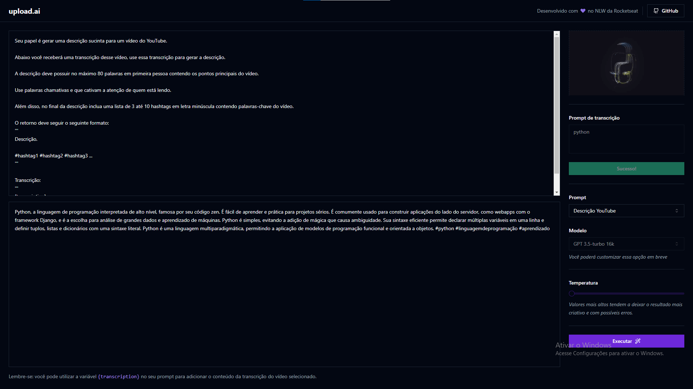

# Upload AI

Um sistema com a capacidade de fazer upload de vídeos através de inteligência artificial, gerando automaticamente títulos e descrições cativantes.

   - Prompt para gerar descrições de vídeos
   - Prompt para gerar títulos de vídeos
   - Regulador de temperatura para ajustar o resultado dos prompts

# Configurações 

### (API)
- Clone o repositório
- Entre na pasta (`cd api`)
- Instalar dependências (`pnpm i`)
- Configure o arquivo `.env` (`OPENAI_KEY`)
- Rode a aplicação (`pnpm run dev`)

### (Web)
  - Entre na pasta (`cd web`)
  - Instalar dependências (`pnpm i`)
  - Rode a aplicação (`pnpm run dev`)

# Tecnologias

- [Fastify](https://fastify.dev/)
- [Open AI](https://platform.openai.com/docs/introduction)
- [React](https://react.dev/)
- [ffmpeg wasm](https://ffmpegwasm.netlify.app/playground)
- [Node](https://nodejs.org/en)

<!--START_SECTION:footer-->
 

## 🔗 Connect with me

<!--END_SECTION:footer-->